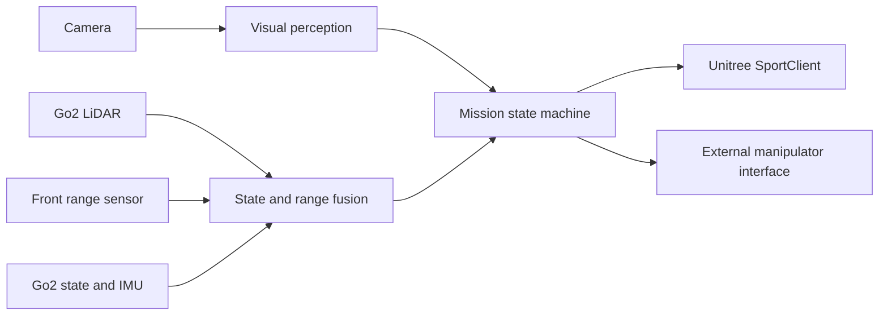

# RAICOM 2026 Multimodal Inspection System

[](https://isocpp.org/)
[](https://www.unitree.com/)
[](LICENSE)

High-level perception and mission-control software for a Unitree Go2–based
multimodal inspection system. The controller integrates line following,
obstacle avoidance, stair traversal, visual command recognition, platform
alignment, and serial coordination with an external manipulator in one
hardware-oriented state machine.

## Competition results

- **National Second Prize**, 2026 RAICOM Robotics Developer Competition — Multimodal Inspection
- **Provincial First Prize**, 2026 RAICOM Robotics Developer Competition — Multimodal Inspection
- **Institution:** Southeast University

Official Chinese competition name: **2026年睿抗机器人开发者大赛（RAICOM）· 多模态巡检**.

## Open-source scope

This repository releases the Go2-side competition controller in
[`src/raicom_multimodal_inspection.cpp`](src/raicom_multimodal_inspection.cpp).
It includes the high-level logic that coordinates robot locomotion, perception,
safety fallbacks, and the serial command interface used by the complete system.

The following components are intentionally not included:

- firmware or onboard source code running on the manipulator;
- Waveshare vendor examples, firmware, or web-control source;
- Unitree SDK2 source code or binary packages;
- private calibration files, device credentials, serial numbers, and local logs;
- competition rulebooks, internal reports, and historical development versions.

The manipulator is therefore treated as an external subsystem. The public
controller shows how the Go2-side mission program coordinates with it, but does
not reproduce its internal implementation.

## System overview



The integrated mission contains five main capability groups:

1. adaptive visual line following and command recognition;
2. LiDAR- and range-sensor-based obstacle avoidance;
3. proprioceptive stair traversal with guarded phase transitions;
4. platform approach, alignment, and failure-aware stopping;
5. mission-level coordination with the external manipulator.

See [docs/SYSTEM_OVERVIEW.md](docs/SYSTEM_OVERVIEW.md) for the software boundary
and execution flow. A function-level navigation guide is available in
[docs/CODE_MAP.md](docs/CODE_MAP.md).

## Requirements

- Linux on the robot computer (Ubuntu 20.04 or 22.04 recommended)
- CMake 3.16+
- a C++17 compiler
- [Unitree SDK2](https://github.com/unitreerobotics/unitree_sdk2)
- OpenCV 4
- pthreads

Unitree SDK2 and OpenCV must be installed separately. This repository does not
vendor either dependency.

## Build

```bash
cmake -S . -B build -DCMAKE_BUILD_TYPE=Release
cmake --build build -j
```

If Unitree SDK2 is installed outside the default prefix, add its installation
location to `CMAKE_PREFIX_PATH`.

## Run

```bash
./build/raicom_multimodal_inspection <network-interface> [options]
```

The program is hardware-specific and is not expected to run meaningfully
without the required robot and sensor streams. Review
[docs/HARDWARE_SETUP.md](docs/HARDWARE_SETUP.md) and
[docs/SAFETY.md](docs/SAFETY.md) before sending commands to physical hardware.

## Reproducibility boundary

This is the competition controller, not a simulator. Hardware-specific camera
exposure, serial-device selection, and calibration values must be validated on
the target system. The public release documents the software architecture and
control flow without publishing private device configuration.

## License

Original code and documentation in this repository are released under the
[BSD 3-Clause License](LICENSE). External dependencies and hardware firmware
retain their own licenses; see [THIRD_PARTY_NOTICES.md](THIRD_PARTY_NOTICES.md).
